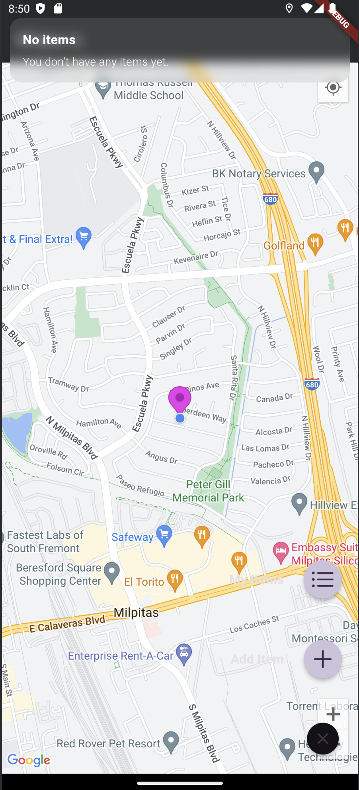
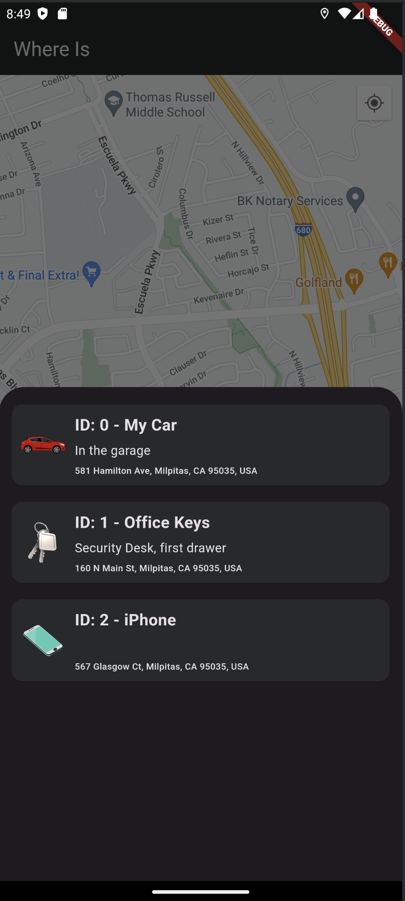

# Track My Items App DEMO

### Description
We have the right to take legal action in the event that the application is shared on the internet, distribution, claiming right ownership, selling it for a fee.
These codes are shared only for you to learn the Flutter.
Anyone who have access to the codes is agreed to have unconditionally accepted these terms.

All Rights Reserved. 
APPBeta Mobile - www.APPBeta.net - Berk ORHAN BETA

English (EN):
* get: State management and dependency injection.
* provider: State management.
* google_maps_flutter: Google Maps integration.
* place_picker_google: Easy location selection on the map.
* geolocator: Accessing the device's geographical location.
* shared_preferences: Local storage of user data.

## About Application
Track My Items is a mobile app that allows users to mark the locations of their everyday items (car, keys, phone, etc.) on Google Maps and track their locations. The app provides a platform where users can store the locations of their items and easily find them when needed.

Users can mark the location of each item on Google Maps, and in case the item gets lost, they can easily locate and retrieve it by checking the stored locations.

- Framework: Flutter
- Programming Language: Dart
- Platform: Android, iOS, Web

## Screenshots from Application

